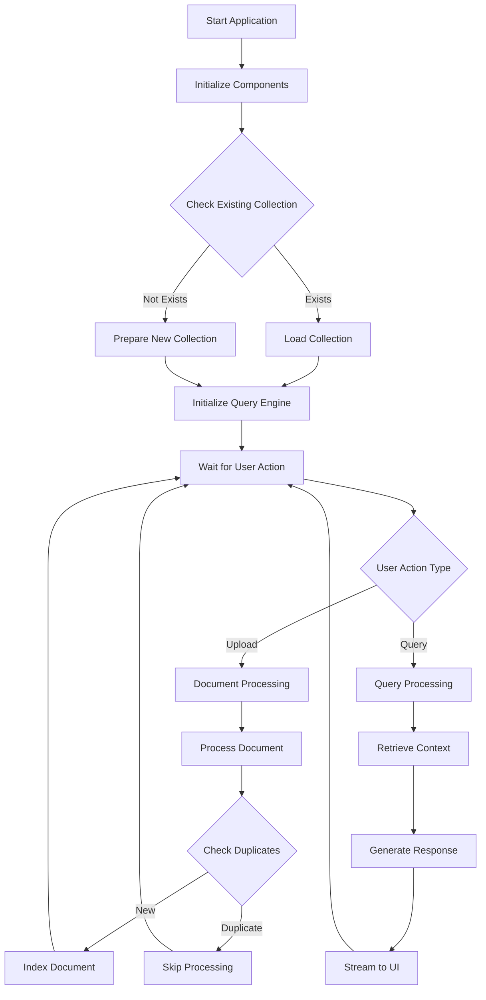
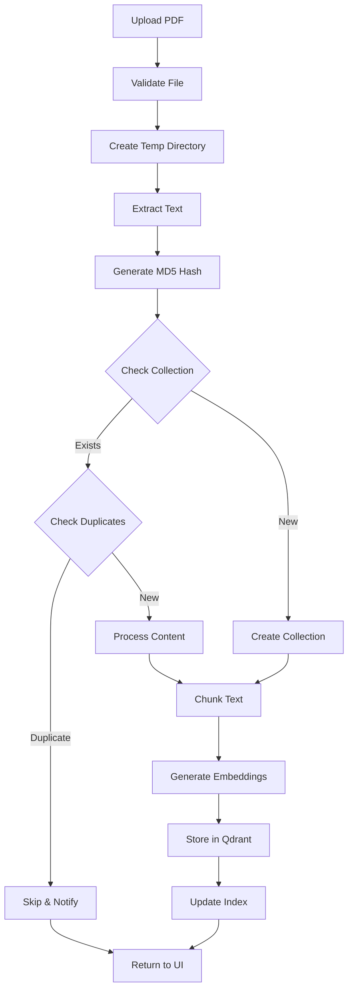
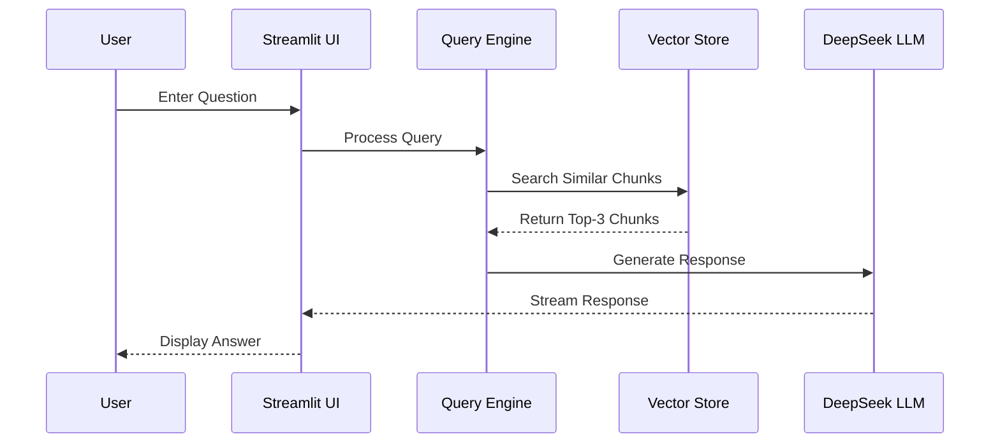
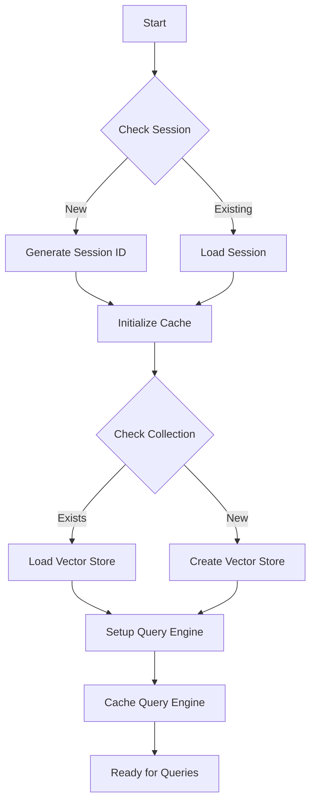
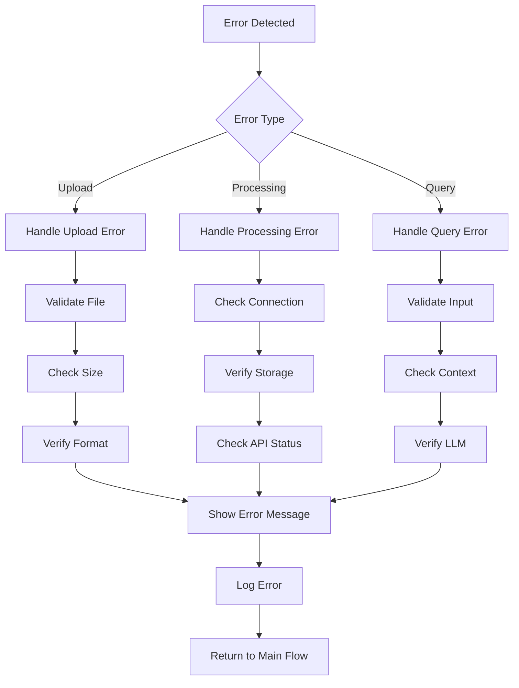

# DeepSeek RAG System Workflow

## System Flow Diagrams

### 1. Overall System Flow


### 2. Document Processing Flow


### 3. Query Processing Flow


### 4. Collection Management Flow


### 5. Error Handling Flow


## System Architecture Overview

```
┌─────────────────┐     ┌──────────────┐     ┌────────────────┐
│  Streamlit UI   │────▶│  LlamaIndex  │────▶│  DeepSeek LLM  │
└─────────────────┘     └──────────────┘     └────────────────┘
        │                      │                      │
        │                      │                      │
        ▼                      ▼                      ▼
┌─────────────────┐     ┌──────────────┐     ┌────────────────┐
│   PDF Upload    │────▶│ Qdrant Store │◀───▶│  BAAI Embed    │
└─────────────────┘     └──────────────┘     └────────────────┘
```

## 1. Application Initialization

### 1.1 Environment Setup
1. Load environment variables
   - DEEPSEEK_API_KEY
   - QDRANT_API_KEY
   - QDRANT_URL
   - LANGCHAIN_API_KEY

### 1.2 Component Initialization
1. Initialize LangSmith tracing
2. Setup Streamlit UI components
3. Configure DeepSeek LLM
4. Initialize BAAI embeddings
5. Setup Qdrant vector store connection

### 1.3 Existing Collection Check
1. Check for existing Qdrant collection
2. If exists:
   - Load existing vector store
   - Initialize query engine
   - Cache for performance
3. If not exists:
   - Prepare for new collection creation

## 2. Document Processing Flow

### 2.1 Document Upload
1. User uploads PDF through Streamlit interface
2. System validates:
   - File type (PDF only)
   - File size
   - File integrity

### 2.2 Content Processing
1. Create temporary directory
2. Save uploaded file
3. Extract text content using SimpleDirectoryReader
4. Generate MD5 hash for content
5. Add content hash to metadata

### 2.3 Deduplication Check
1. Query Qdrant collection with content hash
2. If duplicate found:
   - Skip processing
   - Notify user
3. If new content:
   - Proceed to indexing

### 2.4 Document Indexing
1. Chunk content (512 tokens, 50 overlap)
2. Generate embeddings using BAAI model
3. Store in Qdrant:
   - If new collection: Create and store
   - If existing: Append new documents

## 3. Query Processing Flow

### 3.1 User Input
1. User enters question in chat interface
2. System formats query for processing
3. Updates chat history

### 3.2 Context Retrieval
1. Convert query to embedding
2. Search Qdrant store for similar chunks
3. Retrieve top-3 most relevant chunks
4. Format context for LLM

### 3.3 Response Generation
1. Construct prompt with:
   - Retrieved context
   - User query
   - System instructions
2. Send to DeepSeek LLM
3. Stream response in real-time
4. Update chat interface

## 4. Collection Management Flow

### 4.1 Session Management
1. Generate unique session ID
2. Initialize file cache
3. Setup query engine cache
4. Manage chat history

### 4.2 Vector Store Updates
1. Check collection status
2. For new documents:
   - Generate embeddings
   - Update vector store
   - Maintain metadata
3. Optimize retrieval settings

## 5. Performance Optimization

### 5.1 Caching Strategy
1. Cache query engine using @st.cache_resource
2. Maintain file cache for uploaded documents
3. Reuse existing collections
4. Cache embeddings for frequent queries

### 5.2 Memory Management
1. Clean session state when needed
2. Perform garbage collection
3. Use temporary storage for uploads
4. Stream large responses

## 6. Error Handling Flow

### 6.1 Upload Errors
1. File type validation
2. Size limit checks
3. Content extraction errors
4. Storage capacity issues

### 6.2 Processing Errors
1. Embedding generation failures
2. Vector store connection issues
3. LLM API errors
4. Context retrieval problems

### 6.3 Response Errors
1. Invalid queries
2. Context not found
3. LLM generation issues
4. Stream interruptions

## 7. Security Measures

### 7.1 File Security
1. Temporary file handling
2. Secure file deletion
3. Type validation
4. Size restrictions

### 7.2 API Security
1. Secure key management
2. HTTPS connections
3. Session isolation
4. Access control

## Example Usage Flow

```
1. Start Application
   streamlit run Rag_Deepseek_Local.py

2. First-time Setup
   - System checks for existing collection
   - Initializes vector store
   - Prepares UI

3. Document Upload
   - User uploads PDF
   - System checks for duplicates
   - Processes new content
   - Updates collection

4. Chat Interaction
   - User asks question
   - System retrieves context
   - Generates response
   - Streams answer

5. Continuous Usage
   - Add more documents
   - Query across all content
   - Monitor performance
   - Handle errors
```

This workflow document provides a comprehensive overview of how the DeepSeek RAG system operates, from initialization to continuous usage. Each component and process is designed to work seamlessly together, providing an efficient and user-friendly document question-answering system. 