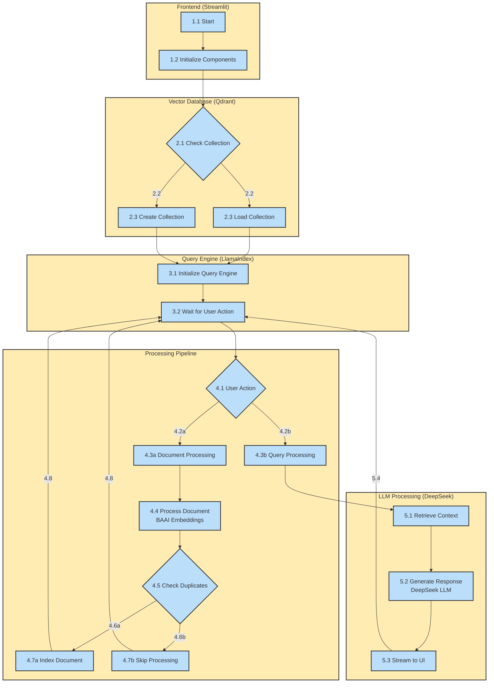

# DeepSeek RAG System Technical Workflow

Flow Sequence:
1. Frontend (Streamlit)
   - 1.1 Application Start
   - 1.2 Initialize Components

2. Vector Database (Qdrant)
   - 2.1 Check Collection
   - 2.2 Determine Collection Status
   - 2.3 Load or Create Collection

3. Query Engine (LlamaIndex)
   - 3.1 Initialize Query Engine
   - 3.2 Wait for User Action

4. Processing Pipeline
   - 4.1 User Action Decision
   - 4.2a/b Branch to Document or Query Processing
   - 4.3a Document Processing Path
   - 4.3b Query Processing Path
   - 4.4 Process Document with BAAI Embeddings
   - 4.5 Check for Duplicates
   - 4.6a/b New or Duplicate Document
   - 4.7a Index New Document
   - 4.7b Skip Duplicate Document
   - 4.8 Return to Wait State

5. LLM Processing (DeepSeek)
   - 5.1 Retrieve Relevant Context
   - 5.2 Generate Response using DeepSeek LLM
   - 5.3 Stream Response to UI
   - 5.4 Return to Wait State